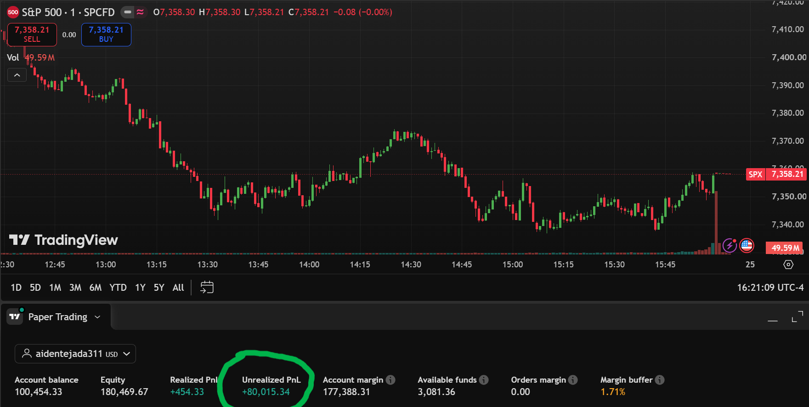

# momentum-screener
# Quantitative Equity Strategy

A momentum-based stock selection system that screens S&P 500 stocks using multi-timeframe analysis and constructs portfolios using CAPM expected returns and volatility-adjusted position sizing.

## Overview

This strategy selects the top 20 stocks from the S&P 500 based on momentum performance across multiple time periods, then allocates portfolio weights using expected returns and risk metrics.
## Performance Results (Paper Trading)



**9-Month Simulation Period:** September 2025 - June 2026

- S&P 500 growth: (7,358.22 − 6,584.29) / 6,584.29 × 100 = **+11.75%**
- Portfolio growth: $80,015 / $100,000 = **+80.02%**
- Outperformance: 80.02% − 11.75% = +68.27 percentage points = **6,827 basis points**
- Strategy maintained positive performance throughout the period with no negative weekly closes


## These were the top 5 screener picks as seen in (/momentum_strategy.xlsx)
*Performance as of June 24, 2026 (~9 months)*

| Rank | Ticker | Avg Cost | Last Price | Return | P&L |
|:----:|:------:|---------:|-----------:|-------:|----:|
| #1 | WDC  | $95.07  | $706.00   | +642.61% | +$38,488.59 |
| #2 | STX  | $191.32 | $1,057.86 | +452.93% | +$24,263.12 |
| #3 | AVGO | $337.58 | $387.00   | +14.64%  | +$642.46    |
| #4 | RCL  | $351.54 | $320.00   | −8.97%   | −$567.72    |
| #5 | CCL  | $31.87  | $29.05    | −8.85%   | −$583.74    |

**Top-5 average return:** +218.47%
**Top-5 combined P&L:** +$62,242.71


## Strategy Components

### Momentum Analysis
The system calculates returns across four time periods:
- 1-year return (25% weight)
- 6-month return (25% weight) 
- 3-month return (30% weight)
- 1-month return (20% weight)

Each stock receives percentile rankings for each period, which are combined into a High Quality Momentum (HQM) score.

### Expected Return Calculation
Uses CAPM model to estimate expected returns:
```
Expected Return = Risk-Free Rate + Beta × (Market Return - Risk-Free Rate)
```
- Risk-free rate: 4.1%
- Market return assumption: 9.5%
- Beta sourced from Yahoo Finance

### Position Sizing
Portfolio weights calculated using:
```
Weight = (HQM Score × Expected Return) ÷ (Volatility + 0.05)
```

Risk management rules:
- Maximum 6.5% position size
- Volatility capped at 13% for calculations
- Mega-cap stocks (AAPL, MSFT, GOOG, GOOGL, NVDA, META) receive 15% liquidity premium

### Portfolio Construction
- Selects top 20 stocks by HQM score
- Calculates share quantities (rounded down to whole shares)
- Normalizes weights to sum to 100%
- Reports cash remaining from rounding

## Code Structure

**datafetcher()**: Retrieves stock data, calculates momentum metrics, percentile rankings, and position weights

**portfolio()**: Takes portfolio size input, calculates share quantities, displays allocation table with risk metrics

**xlsx_writer()**: Exports results to formatted Excel spreadsheet with professional styling

## Requirements

- Python packages: pandas, numpy, yfinance, scipy, xlsxwriter
- S&P 500 stock list (sp500.csv file)
- Internet connection for real-time price data

## Output

The system generates:
- Console display of top 20 stock allocations
- Portfolio expected return and risk score
- Excel export with all calculated metrics
- Cash allocation and remaining balance

## Usage

Run the script and enter your portfolio size when prompted. The system will fetch current data, perform calculations, and display/export results.
